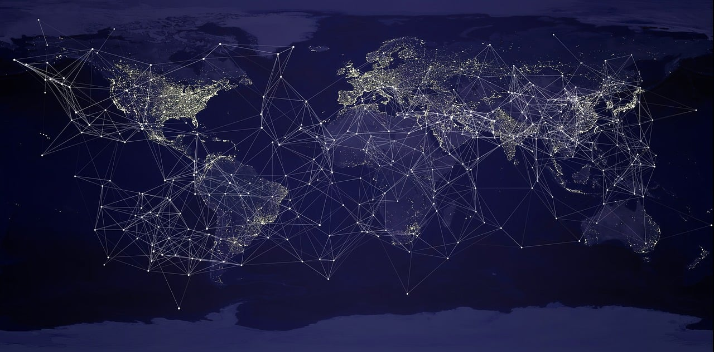

## Oregon Community Internet Access Analysis

Ethan Heine

**Summary**

This project involves analyzing and visualizing internet access data in Oregon counties and Census tracts. The goal of this project is to calculate statistics to better understand access and performance of internet in the area, as well as mapping the data. The project will look at the differences in access and performance between urban and rural communities.

**Data**

* [US Census 2022 TIGER/Line Shapefiles: Counties](https://www.census.gov/cgi-bin/geo/shapefiles/index.php?year=2022&layergroup=Counties+%28and+equivalent%29)
* [US Census 2022 TIGER/Line Shapefiles: Census Tracts](https://www.census.gov/cgi-bin/geo/shapefiles/index.php?year=2022&layergroup=Census+Tracts)
* [Ookla Global Internet Speedtest Data](https://github.com/teamookla/ookla-open-data)
* [M-Lab Internet Speed Test](https://www.measurementlab.net/data/)
* [NTIA County Level Broadband Indicator Data](https://broadbandusa.maps.arcgis.com/home/item.html?id=f8d0b09e473942abb5fb52901dc2fe0f)
* [NTIA Tract Level Broadband Indicator Data](https://broadbandusa.maps.arcgis.com/home/item.html?id=0571a8436a8f4b909ccc5d54b4e6d245)
* [USDA Rural-Urban Codes](https://www.ers.usda.gov/data-products/rural-urban-continuum-codes.aspx)

**Packages**

* Geopandas
* Pandas
* Matplotlib

**Outcomes**

The data and results of this project can be used to analyze the needs of Oregon communties in terms of internet access, and implement solutions to make it more accessible where needed. Processes can be applied to other states and the country as a whole.
